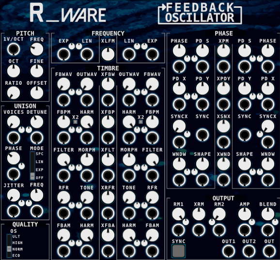

# Feedback Oscillator

The Feedback Oscillator sits somewhere between a traditional sound source and a reactive sound system. It is not a classic VCO (see: [Oscillator](../../Glossary/Oscillator.md)) in the usual sense, but rather an oscillator that continuously listens to itself.

The Feedback Oscillator is an oscillator with an internal feedback path (see: [Feedback](../../Glossary/Feedback.md)). Instead of producing a fixed, predictable waveform, the module reacts to its own output, making even small adjustments clearly audible.
